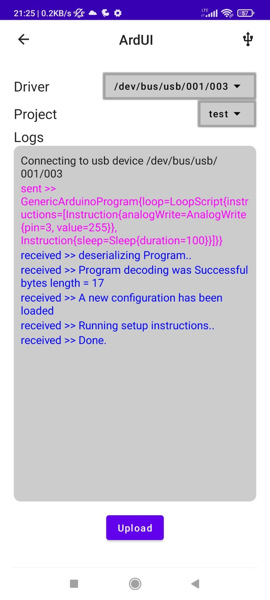

# ArdUI

This project aims to simplify creation of basic Arduino programs by just editing
a UI on Android. Instead of the usual Arduino development cycle:


You have just to create your program via the Android UI and send it Arduino via
Serial.

<p float="left">
  
  
  
  
</p>

In order to make the setup work you have to do two things

### Build and deploy the generic circuit to your Arduino board.

in order to do that

- Include the ArdUI.zip (./arduino-library/generated/c/ArdUI.zip) library

  _(You can include the Library zip can in Arduino IDE via: Sketch -> Include
  Library -> Add .ZIP Library.)_
- Upload
  [GenericCircuit.ino](./arduino-library/sketches/GenericCircuit/GenericCircuit.ino)
  to your Arduino board.

That's it!

All subsequent changes to the Arduino Program can be done with Android UI now.

## Technical details

Below is a technical description for whats happening under the hood

The workflow go as described here

- a [Protobuf](https://developers.google.com/protocol-buffers) file is used to
  describe the serialization/deserialization of data between Kotlin objects,
  byte streams and C structures. the Protbuf file used here to describe the data
  format is located at [./proto/common.proto](./proto/common.proto)

- The Android application allows to create a program in UI which is translated
  to data classes generated by the Protobuf generator.

- This data is serialized and sent to Arduino via the Serial.

- The C program in Arduino deserializes the received bytes and construct the set
  of instructions to run.

The fact that Protobuf is supported for an array of languages allowed us to
write programs in Kotlin (for Android), C (for Arduino) and JS (for a NodeJS
app)

## Web interface

A NodeJS application is provided too in case you don't have access to an Android
phone. The interface is pretty simple and basic; you have 2 text fields:

1. For setup instructions
2. For loop instructions

This is the syntax to use for writing instructions:

```
pinmode [input|output|input_pullup]
digitalwrite pin [low|high]
analogwrite pin value
sleep duration
```

Press upload button and it should work.  
More details can be found [Here](./html-serial-ui/README.md)

## How bindings are generated?

### Java bindings

This is generated using the [wire library](https://github.com/square/wire), the
[gradle plugin](https://github.com/square/wire/blob/master/wire-library/docs/wire_compiler.md)
seemed like the easiest way, all you need is for this case is to include

```groovy
wire {
    sourcePath {
        srcDir '../../proto'
    }
    kotlin{}
}
```

in your `build.gradle` file, and it will keep your generated stub up to date
with the protobuf spec.

### C bindings

The C binding is generated with nanopb library; it is a small code-size Protocol
Buffers implementation in ansi C. It is especially suitable for use in
microcontrollers, but fits any memory restricted system.

C bindings are generated for our project with the following steps:

1. clone the repository locally

```
git clone https://github.com/nanopb/nanopb.git
```

2. generate the bindings from .proto files:

```
NANOPB=path/to/nanopb
${NANOPB}/generator/nanopb_generator.py \
  -D generated/c \
  -I app/proto \
  common.proto
```

3. copy the utility nanopb files:

```
cp ${NANOPB}/pb_common.h \
   ${NANOPB}/pb_common.c \
   ${NANOPB}/pb_decode.h \
   ${NANOPB}/pb_decode.c \
   ${NANOPB}/pb.h \    
   ./arduino-library/generated/c
   
zip -j ./arduino-library/generated/c/ArdUI.zip /./arduino-library/generated/c/*.h /arduino-library/generated/c/*.c
```

You can include the Library zip can in Arduino IDE via:\
_Sketch -> Include Library -> Add .ZIP Library.._

N.B: probably you will need the nanopb dependencies for Python.

You can install them with:

```
pip3 install scons protobuf grpcio-tools
```

### JS bindings

to create the needed JS binding you can run the following command:

```
protoc --proto_path=./proto \
       --js_out=import_style=commonjs,binary:html-serial-ui/js \
       common.proto
```

More details can be found
[Here](https://developers.google.com/protocol-buffers/docs/reference/javascript-generated)

## Limitations

- Currently, only 8 instructions are supported for setup and 16 for loop.

- 4 types of instructions are supported now:
  - setPinMode
  - digitalWrite
  - analogWrite
  - sleep

## Contributions

Contributions are welcome!\
Just create your pull request and it will be reviewed and merged ASAP.

## Found a bug?

Describe your bug and the steps to reproduce it in an issue and it will be
addressed by us.
