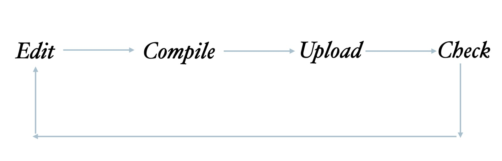

# MagicEmbed

This project aims to simplify creation of basic Arduino programs by just editing a UI on Android. Instead of the usual Arduino development cycle: 

  

You have just to create your program via the Android UI and send it Arduino via Serial.  
// TODO add a screenshot for the UI.  

For Arduino You have to do just two things:   
- Include the [MagicEmbed.zip](./generated/c/MagicEmbed.zip) library
- Upload [GenericProgram.ino](./sketches/GenericCircuit/GenericCircuit.ino) once to your Arduino board.

That's it!  
All subsequent changes to the Arduino Program can be done with Android UI only now.

## Technical details

This is a technical detailed description of what was done exactly if you are interested in it.  

The Android UI collect from the user two set of instructions:  
1. Setup instructions  
2. Loop instructions  

Both are combined to build the usual Arduino program. Protobuf is used to describe the program and is compiled into:  
- Java
- C
- JS

This is the Protobuf file contents for the generic Arduino program:  
[generic-program-proto](./app/proto/common.proto)

When UI collect program instructions from the user:  
- the Java binding is generated to be used for the Android to get an array of bytes
- those bytes are transferred via serial to Arduino
- those bytes are received in Arduino and used to deserialize the C binding of the program
- the setup and loop instructions are updated
- the Arduino board start to work with the new program

## Web interface
A nodejs application is provided too in case you don't have access to an android phone.
The interface is pretty simple and basic; you have 2 text fields:
1. For setup instructions
2. For loop instructions
This is the syntax to use for writing instructions:  
```
pinmode [input|output|input_pullup]
digitalwrite pin [low|high]
analogwrite pin value
sleep duration
```
You have to specify the arduino port in `server/index.js`  
Press upload button and it should work.


## How bindings are generated?
### Java bindings
// TODO

### C bindings

The C binding is generated with nanopb libarary; it is a small code-size Protocol Buffers implementation in ansi C. It is especially suitable for use in microcontrollers, but fits any memory restricted system.  

C bindings are generated for our project with the following commands:

1. clone the repository locally
```
git clone https://github.com/nanopb/nanopb.git
```

2. generate the bindings from .proto files:
```
path/to/nanopb/generator/nanopb_generator.py \
  -D generated/c \
  -I app/proto \
  common.proto 
```

3. copy the utility nanopb files:
```
cp path/to/nanopb/pb_common.h \
   path/to/nanopb/pb_common.c \
   path/to/nanopb/pb_decode.h \
   path/to/nanopb/pb_decode.c \
   path/to/nanopb/pb.h \    
   generated/c
   
zip -j generated/c/MagicEmbed.zip generated/c/*.h generated/c/*.c
```

You can include the Library zip can in Arduino IDE via:  
*Sketch -> Include Library -> Add .ZIP Library..*

N.B: probably you will need the nanopb dependencies for Python. You can install them via:  
```
pip3 install scons protobuf grpcio-tools
```


### Js bindings
// TODO create a simple HTML UI with a nodejs server
to create the needed JS binding you can run the following command:
```
protoc --proto_path=app/proto \
       --js_out=import_style=commonjs,binary:host-ui/js \
       common.proto
```

More details can be found  
[Here](https://developers.google.com/protocol-buffers/docs/reference/javascript-generated)

## Limitations
- Currently, only 8 instructions are supported for setup and 16 for loop.
  
- 4 types of instructions are supported now: setPinMode, digitalWrite, analogWrite and sleep.  

## Contributions
Contributions are welcome! Just create your pull request and it will be reviewed and merged ASAP.
